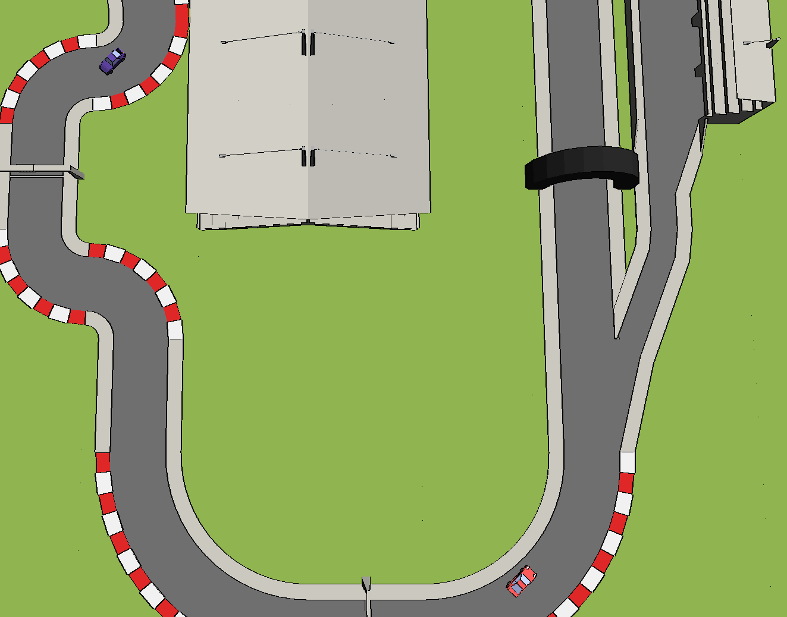

# Carambolage
  
---
## A game written in Rust!

We are big fans of Rust and have been using this programming language in our working environment for some time now. After getting used to the fact that Rust doesn't let us get away with stupid things that crash our code at runtime (at least that's how we see it at the moment), we've become attached to this modern language. 

Sadly, you're always busy learning good patterns during your work, so you have to think about and rethink sooo much, and the fun is a little bit left behind. That's why we decided to write a little game in Rust. This is all about the fun of programming (if you found this project on GitHub, you can probably understand that). But that also means that we don't think so much about what we're typing down now.

## Contents
1. [Authors](#authors)
2. [License](#license)
3. [Download](#download)
4. [Contributing](#contributing)
5. [Just saying thank you](#a-huge-thanks-to)

## Authors
- [fabric-and-ink](https://github.com/fabric-and-ink)
- [K4ugummi](https://github.com/K4ugummi)

## License
This program and all its resources are licensed under [GNU General Public License v3](/LICENSE)

## Download
~~You can download precompiled binaries for your system below:~~  
Sorry, we are just getting started on developing this game, so there are no precompiled binaries yet. Nevertheless if you want to run this game, feel free to clone or download this project and compile it yourself. 
- ~~Windows~~
- ~~Linux~~
- ~~MacOS~~

## Contributing

### Dependencies
- [GLFW](https://github.com/PistonDevelopers/glfw-rs)
- OpenGL 3.3 compatible hardware

### Build
You have to setup GLFW on your system in order to build the game. If you encounter any problems setting up your system for compilation, feel free to file an [issue](https://github.com/fabric-and-ink/carambolage/issues/).

## A huge thanks to
- [The Rust Team](https://www.rust-lang.org/en-US/team.html) and everybody who is contributing to this project!
- [DeepL Translator](https://www.deepl.com/translator) for an intelligent translation tool, which lets non native speakers write comments or readmes in proper english!
- **YOU** for spending your time reading this readme, playing the game or even contributing to the project!